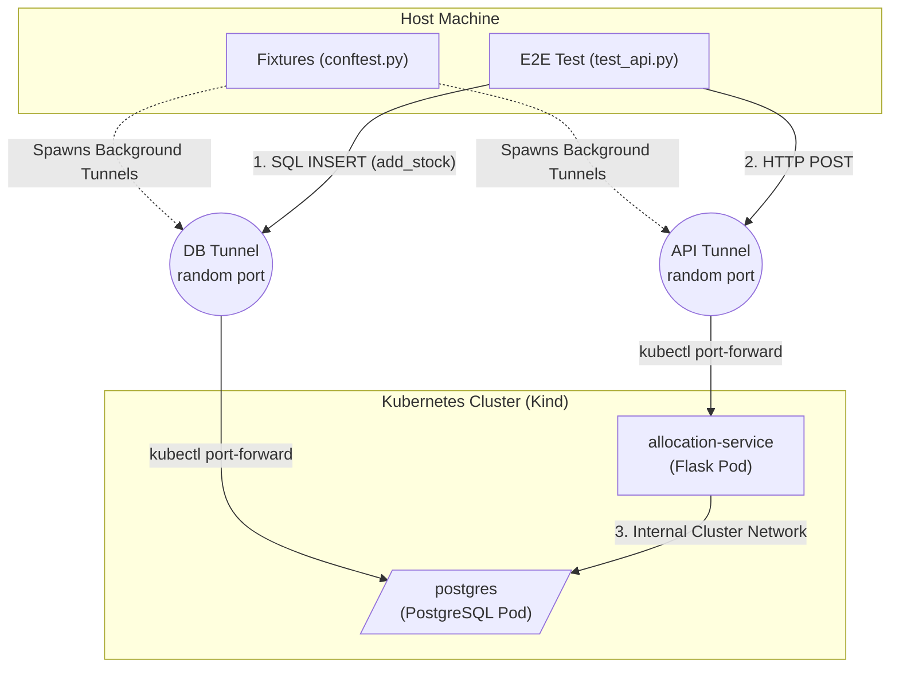

# Walkthrough: End-to-End Testing with Kubernetes (Kind)

This walkthrough breaks down the mental model and architecture of how your End-to-End (E2E) tests operate against an isolated Kubernetes environment.

## The Architecture

When you run your tests, they execute locally on your host machine. However, the application code (the Flask API) and the database (PostgreSQL) run entirely isolated inside a Kubernetes `kind` cluster. 

To bridge this gap, your test suite automatically spins up secure "tunnels" allowing your local test scripts to communicate directly with the internal Kubernetes services.



---

## 1. The Tunnels (Pytest Fixtures)

Because your tests run outside the cluster, they can't natively use Kubernetes DNS (like `http://allocation-service`). Instead, we use Pytest fixtures in `conftest.py` to dynamically create `kubectl port-forward` processes.

### The `postgres_db` Fixture
This fixture prepares a clean slate for testing:
1. It requests a random, free port from the host OS.
2. It launches `kubectl port-forward service/postgres <random-port>:5432` in the background.
3. It connects to the database using SQLAlchemy via `127.0.0.1:<random-port>`.
4. It performs a **"Nuke and Pave"** (drops and recreates all tables) so the test environment is completely clean.

### The `api_url` Fixture
This fixture prepares the API for HTTP requests:
1. It requests another random port.
2. It launches `kubectl port-forward service/allocation-service <random-port>:80`.
3. It repeatedly pings the API until it gets a successful response, ensuring the tunnel is active before the tests start.
4. It hands the generated URL (e.g., `http://localhost:49152`) to the test script.

---

## 2. Setting Up Test Data (The Backdoor)

In E2E testing, you want to test the full lifecycle, but relying *only* on the API to set up the starting state can be slow and brittle. We use a "backdoor" directly to the database.

> [!TIP]
> **Data Seeding**
> The `add_stock` fixture provides a helper function that executes raw `INSERT` SQL statements directly into the PostgreSQL pod via the database tunnel. This allows you to instantly seed the exact state needed before hitting the API.

```python
# From test_api.py
def test_happy_path_returns_201_and_allocated_batch(api_url, add_stock):
    # 1. Setup: Use the DB tunnel backdoor to inject state
    add_stock([
        (laterbatch, sku, 100, "2026-05-02"),
        (earlybatch, sku, 100, "2026-05-01"),
        (otherbatch, othersku, 100, None),
    ])
```

---

## 3. Executing the Test (The Frontdoor)

With the database seeded, the test proceeds to act as a real client.

```python
    # 2. Execution: Hit the API via the API tunnel
    response = requests.post(f"{api_url}/allocate", json = {
        "orderid": "order-123",
        "sku": sku,
        "qty": 10
    })    
    
    # 3. Validation
    assert response.status_code == 201
    assert response.json()["batchref"] == earlybatch
```

When this HTTP request is made:
1. It hits `localhost:<random-port>`.
2. The `kubectl port-forward` background process grabs the traffic and pushes it into the `allocation-service` Pod inside the Kubernetes cluster.
3. The Flask application receives the request, processes the domain logic, and connects to the database using the internal Kubernetes network.
4. The response makes its way back out through the tunnel to satisfy the `assert` statements in the test.

---

## Why this Pattern is Powerful

> [!IMPORTANT]
> **High Fidelity Testing**
> This setup provides immense confidence because it tests the application exactly as it runs in production—running inside isolated containers, connected over a network, using a real relational database.

At the same time, because the infrastructure management (port-forwarding, schema resetting, process cleanup) is abstracted away into Pytest fixtures, the developer experience remains as fast and simple as writing local unit tests.
