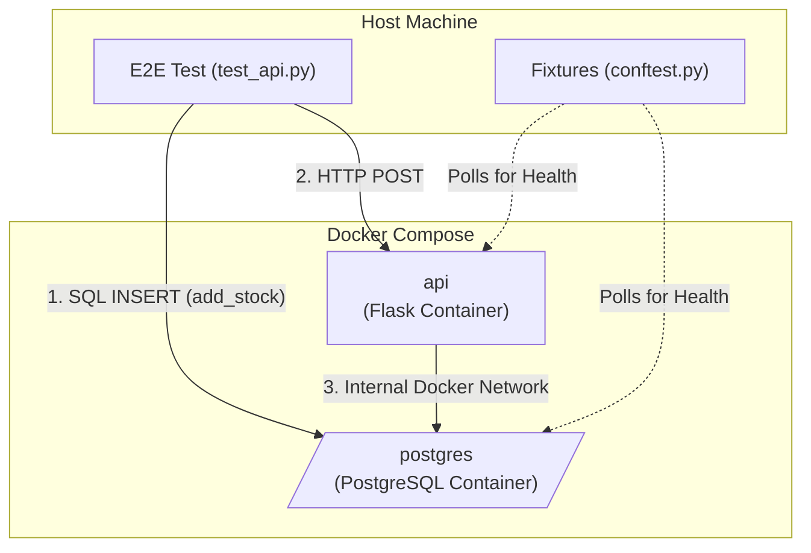

# Walkthrough: End-to-End Testing with Docker Compose

This walkthrough breaks down the mental model and architecture of how your End-to-End (E2E) tests operate against an isolated Docker environment.

## The Architecture

When you run your tests, they execute locally on your host machine. However, the application code (the Flask API) and the database (PostgreSQL) run entirely isolated inside a Docker Compose environment. 

To bridge this gap, your test suite automatically polls the exposed ports on localhost allowing your local test scripts to communicate directly with the containers once they are healthy.


```mermaid
graph TD
    subgraph Host Machine
        T["E2E Test (test_api.py)"]
        F["Fixtures (conftest.py)"]
    end

    subgraph "Docker Compose"
        API["api<br/>(Flask Container)"]
        DB[/"postgres<br/>(PostgreSQL Container)"/]
    end

    F -. "Polls for Health" .-> API
    F -. "Polls for Health" .-> DB

    T -- "1. SQL INSERT (add_stock)" --> DB
    T -- "2. HTTP POST" --> API

    API -- "3. Internal Docker Network" --> DB
```

---

## 1. The Setup (Pytest Fixtures)

Because your tests run outside the container network, they can't natively use internal DNS (like `http://api`). Instead, we map ports to `localhost` in `docker-compose.yml` and use Pytest fixtures in `conftest.py` to ensure they are ready before tests run.

### The `postgres_db` Fixture
This fixture prepares a clean slate for testing:
1. It connects to the database using SQLAlchemy via `localhost:5432` (or whatever `DB_PORT` is set to).
2. It polls the database until it successfully connects.
3. It performs a **"Nuke and Pave"** (drops and recreates all tables) so the test environment is completely clean.

### The `api_url` Fixture
This fixture prepares the API for HTTP requests:
1. It reads the API URL from configuration (defaulting to `http://localhost:5005`).
2. It repeatedly pings the API until it gets a successful response, ensuring the service is fully booted before the tests start.
3. It hands the URL to the test script.

---

## 2. Setting Up Test Data (The Backdoor)

In E2E testing, you want to test the full lifecycle, but relying *only* on the API to set up the starting state can be slow and brittle. We use a "backdoor" directly to the database.

> [!TIP]
> **Data Seeding**
> The `add_stock` fixture provides a helper function that executes raw `INSERT` SQL statements directly into the PostgreSQL container via the mapped port. This allows you to instantly seed the exact state needed before hitting the API.

```python
# From test_api.py
def test_happy_path_returns_201_and_allocated_batch(api_url, add_stock):
    # 1. Setup: Use the DB backdoor to inject state
    add_stock([
        (laterbatch, sku, 100, "2026-05-02"),
        (earlybatch, sku, 100, "2026-05-01"),
        (otherbatch, othersku, 100, None),
    ])
```

---

## 3. Executing the Test (The Frontdoor)

With the database seeded, the test proceeds to act as a real client.

```python
    # 2. Execution: Hit the API via localhost
    response = requests.post(f"{api_url}/allocate", json = {
        "orderid": "order-123",
        "sku": sku,
        "qty": 10
    })    
    
    # 3. Validation
    assert response.status_code == 201
    assert response.json()["batchref"] == earlybatch
```

When this HTTP request is made:
1. It hits `localhost:5005`.
2. Docker port mapping routes the traffic into the `api` container.
3. The Flask application receives the request, processes the domain logic, and connects to the database using the internal Docker network.
4. The response makes its way back out to satisfy the `assert` statements in the test.

---

## Why this Pattern is Powerful

> [!IMPORTANT]
> **High Fidelity Testing**
> This setup provides immense confidence because it tests the application exactly as it runs in production—running inside isolated containers, connected over a network, using a real relational database.

At the same time, because the infrastructure management (health polling, schema resetting, DB teardowns) is abstracted away into Pytest fixtures, the developer experience remains as fast and simple as writing local unit tests.
