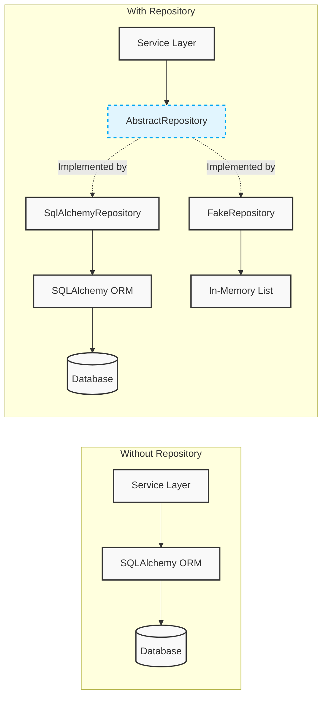
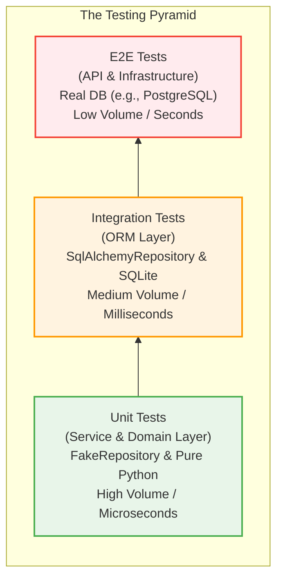

# The Repository Pattern and The Testing Pyramid

## The Infrastructure Coupling Problem

The Repository Pattern addresses a foundational challenge in Domain-Driven Design (DDD): **The Infrastructure Coupling Problem**. Without it, the application's core business logic becomes tightly coupled to the database technology (e.g., SQLAlchemy).

The Repository Pattern eliminates several specific issues caused by this coupling:

### 1. The "Mocking SQLAlchemy is a Nightmare" Problem

When testing business logic without a database, you must write a Python mock for the database interactions. Mocking a complex ORM like SQLAlchemy is notoriously difficult.

For example, to mock `session.query(Batch).filter_by(ref_id=ref_id).first()`, you have to mock `.query()`, `.filter_by()`, and `.first()`. Your tests end up testing the intricate setup of these mocks rather than your actual code.

**The Solution:** The Repository provides a simple, standard interface (`repo.add()`, `repo.get()`, `repo.list()`). Mocking or faking this interface is straightforward. As seen in `FakeRepository`, simulating the database requires only a few lines of code using an in-memory list.

### 2. The Domain Contamination Problem

The Domain Model (e.g., the rules for allocating stock) is the most critical part of the application and should be written in "pure" Python. If the business logic calls `session.execute()` or uses ORM-specific methods, it becomes permanently glued to the database technology.

**The Solution:** The Repository acts as a boundary between the domain and the infrastructure. The domain asks the repository for data; the repository interacts with the database, translates the raw data into pure Python objects (like `Batch`), and returns them to the domain.

### 3. The "State Metaphor" Problem

A database is a complex external I/O system, but conceptually, it simply holds a collection of objects. 

**The Solution:** The Repository pattern creates an illusion, making the database look and behave like a simple in-memory Python collection that you can `.add()` to and `.get()` from.

---

## Architectural Impact

By defining an `AbstractRepository` interface, we create a "plug socket" for data access.

---

## Enabling The Testing Pyramid

The decoupling achieved by the Repository Pattern is what makes a robust and fast testing strategy possible.

If the Service Layer used SQLAlchemy directly, every test would require a database. By utilizing the Repository pattern, we can "unplug" the real database and "plug in" the `FakeRepository` without changing a single line of Service Layer code.

This allows us to construct a healthy **Testing Pyramid**:

- **Unit Tier:** Business logic is tested using pure Python data structures (`FakeRepository`), allowing for extremely fast execution.
- **Integration Tier:** Database mappings and repository implementations are validated using an in-memory database like SQLite.
- **E2E Tier:** The entire system is tested end-to-end using a real database engine.
